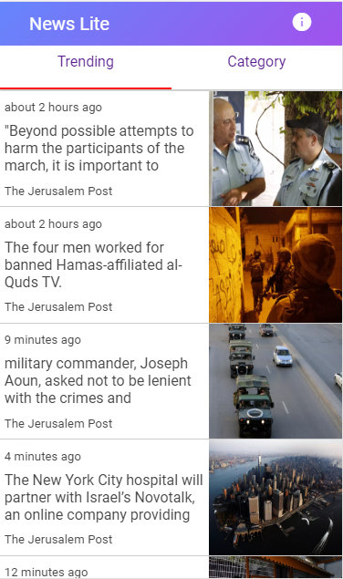

# News Lite(PWA)
 > This is an example of a PWA built using React


##The data is powered by NewsAPI.org

This project was bootstrapped with [Create React App](https://github.com/facebookincubator/create-react-app).

Below you will find some information on how to perform common tasks.<br>
You can find the most recent version of this guide [here](https://github.com/facebookincubator/create-react-app/blob/master/packages/react-scripts/template/README.md).


#### Screen Shots 



## Build Setup
``` bash
# Add API Key from  newsapi.org in .env.development file
REACT_APP_API_KEY = <API_KEY>

# serve with hot reload at localhost:3000
yarn start

# build for production with minification
yarn build

# build for production and view the bundle analyzer report
npm run build --report

```